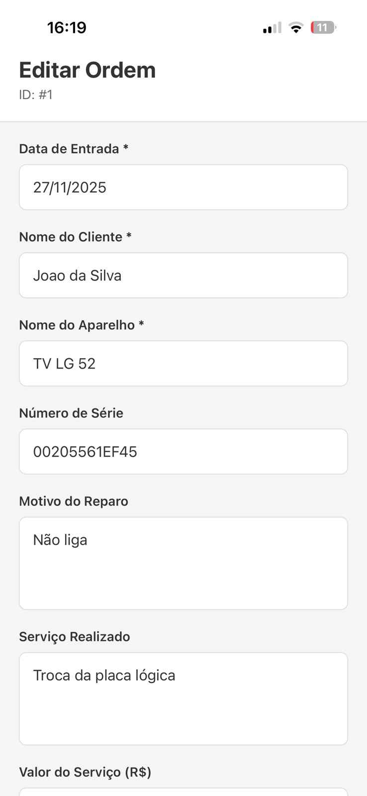
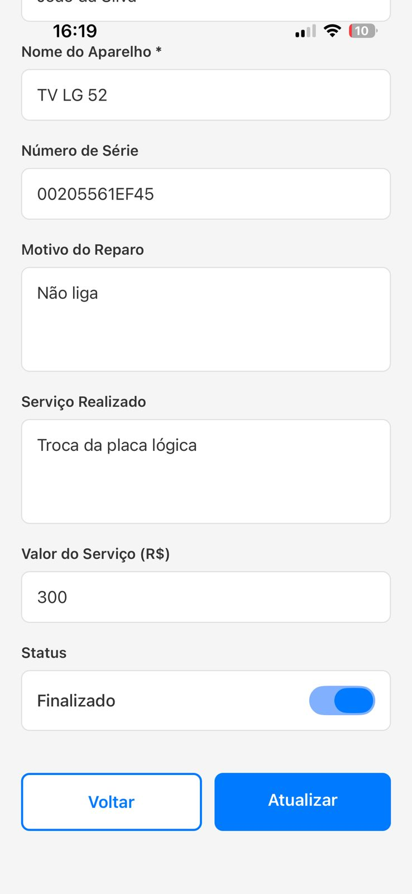

# 🔧 App de Ordens de Serviço

Aplicativo React Native desenvolvido com Expo para cadastro e gerenciamento de Ordens de Serviço. Sistema completo com persistência local de dados.

## 🚀 Tecnologias

- **React Native** com **Expo SDK 51**
- **TypeScript**
- **React Navigation** (Stack Navigator)
- **SQLite** (expo-sqlite) para banco de dados local
- **React Native Screens** e **Safe Area Context**

## 📋 Funcionalidades

- ✅ **Tela de Boas-vindas** - Welcome Screen ao abrir o app
- ✅ **Listagem de ordens** - Visualize todas as ordens de serviço
- ✅ **Cadastro de novas ordens** - Crie ordens com todos os detalhes
- ✅ **Edição de ordens** - Atualize informações existentes
- ✅ **Botão Voltar** - Saia sem salvar alterações
- ✅ **Indicador visual de status** - Finalizado/Pendente
- ✅ **Banco de dados SQLite** - Persistência local robusta e eficiente
- ✅ **Interface moderna** - Design limpo e profissional

## 📸 Screenshots

### 1. Tela de Boas-vindas


### 2. Tela Principal - Lista de Ordens


### 3. Tela de Cadastro/Edição (Parte 1)


### 4. Tela de Cadastro/Edição (Parte 2)


## 🛠️ Instalação

### Pré-requisitos

- Node.js (versão 18 ou superior)
- npm ou yarn
- Expo Go instalado no celular ([iOS](https://apps.apple.com/app/expo-go/id982107779) | [Android](https://play.google.com/store/apps/details?id=host.exp.exponent))

### Passos

1. **Clone o repositório:**
   ```bash
   git clone <url-do-repositorio>
   cd Recuperação
   ```

2. **Instale as dependências:**
   ```bash
   npm install
   ```

3. **Inicie o servidor Expo:**
   ```bash
   npm start
   ```

4. **Execute no dispositivo:**
   - Escaneie o QR code com o app Expo Go
   - Ou pressione `a` para Android ou `i` para iOS (emulador)

## 📱 Como Usar

### Modos de Conexão

**Tunnel (Recomendado - funciona em qualquer rede):**
```bash
npm run start:tunnel
```

**LAN (mesma rede Wi-Fi):**
```bash
npm run start:lan
```

**Com cache limpo:**
```bash
npm run start:clear
```

## 🔧 Scripts Úteis

O projeto inclui scripts PowerShell para facilitar o desenvolvimento:

- **`verificar-instalacao.ps1`** - Verifica se o ambiente está configurado corretamente
- **`corrigir-conexao.ps1`** - Corrige problemas de conexão
- **`corrigir-platformconstants.ps1`** - Resolve erros de PlatformConstants

Para executar:
```powershell
.\verificar-instalacao.ps1
```

## ⚠️ Solução de Problemas

### Erro: "Could not connect to the server"

1. **Use Tunnel:**
   ```bash
   npm run start:tunnel
   ```

2. **Limpe o cache:**
   ```powershell
   npm cache clean --force
   Remove-Item -Recurse -Force .expo -ErrorAction SilentlyContinue
   npm run start:clear
   ```

3. **Verifique o firewall** - Permita Node.js no firewall do Windows

### Erro: "PlatformConstants could not be found"

1. **Atualize o Expo Go** no celular para a versão mais recente
2. **Limpe e reinstale:**
   ```powershell
   Remove-Item -Recurse -Force node_modules
   npm install
   npm run start:clear
   ```

### Erro: "Project is incompatible with this version of Expo Go"

- O projeto usa **Expo SDK 51**
- Certifique-se de que o Expo Go está atualizado
- Se necessário, execute: `npx expo install --fix`

## 📁 Estrutura do Projeto

```
├── App.tsx                    # Componente principal com navegação
├── app.json                   # Configuração do Expo
├── package.json               # Dependências do projeto
├── tsconfig.json              # Configuração TypeScript
├── babel.config.js            # Configuração Babel
├── metro.config.js            # Configuração Metro Bundler
├── src/
│   ├── screens/
│   │   ├── WelcomeScreen.tsx  # Tela de boas-vindas
│   │   ├── HomeScreen.tsx     # Lista de ordens
│   │   └── CadastroScreen.tsx  # Formulário de cadastro/edição
│   ├── services/
│   │   └── ordemServicoService.ts  # Serviço de persistência
│   ├── database/
│   │   └── database.ts        # Configuração do banco SQLite
│   └── types/
│       └── OrdemServico.ts    # Tipos TypeScript
└── README.md                  # Este arquivo
```

## 📊 Estrutura de Dados

Cada Ordem de Serviço contém:

- `id`: Número único (gerado automaticamente)
- `data`: Data de entrada (DD/MM/AAAA)
- `nome_cliente`: Nome do cliente (obrigatório)
- `nome_aparelho`: Nome do aparelho (obrigatório)
- `numero_serie`: Número de série
- `motivo_reparo`: Motivo do reparo
- `servico_realizado`: Serviço realizado
- `valor_servico`: Valor do serviço (número)
- `finalizado`: Status (true/false)

## 💾 Banco de Dados

O app utiliza **SQLite** (expo-sqlite) para persistência de dados:

- ✅ **Banco de dados relacional** - Estrutura organizada e eficiente
- ✅ **Dados persistem** após fechar o app
- ✅ **Funciona offline** - Não requer conexão com internet
- ✅ **Performance otimizada** - Consultas rápidas e indexadas
- ✅ **Dados seguros** - Armazenados localmente no dispositivo
- ✅ **Tabela criada automaticamente** na primeira execução

### Estrutura da Tabela

```sql
CREATE TABLE ordens_servico (
  id INTEGER PRIMARY KEY AUTOINCREMENT,
  data TEXT NOT NULL,
  nome_cliente TEXT NOT NULL,
  nome_aparelho TEXT NOT NULL,
  numero_serie TEXT,
  motivo_reparo TEXT,
  servico_realizado TEXT,
  valor_servico REAL NOT NULL,
  finalizado INTEGER NOT NULL DEFAULT 0
);
```

## 🔄 Próximos Passos

O app já utiliza SQLite para persistência local. Para integração com API ou banco de dados remoto, você pode:

1. Criar um serviço de API separado
2. Manter SQLite como cache local
3. Sincronizar dados quando houver conexão

## 📝 Notas

- O ID é gerado automaticamente para novas ordens
- A data padrão é preenchida automaticamente com a data atual
- Campos obrigatórios: Nome do Cliente e Nome do Aparelho
- O botão "Voltar" permite sair sem salvar alterações

## 🤝 Contribuindo

1. Faça um fork do projeto
2. Crie uma branch para sua feature (`git checkout -b feature/AmazingFeature`)
3. Commit suas mudanças (`git commit -m 'Add some AmazingFeature'`)
4. Push para a branch (`git push origin feature/AmazingFeature`)
5. Abra um Pull Request

## 📄 Licença

Este projeto está sob a licença MIT.
---

**Versão:** 1.0.0  
**Expo SDK:** 51.0.0  
**React Native:** 0.74.5

---

**Trabalho para:** LABORATÓRIO DE DESENVOLVIMENTO DISPOSITIVOS MOVEIS
